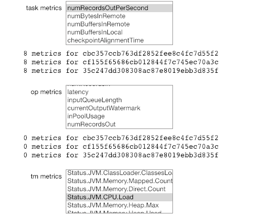
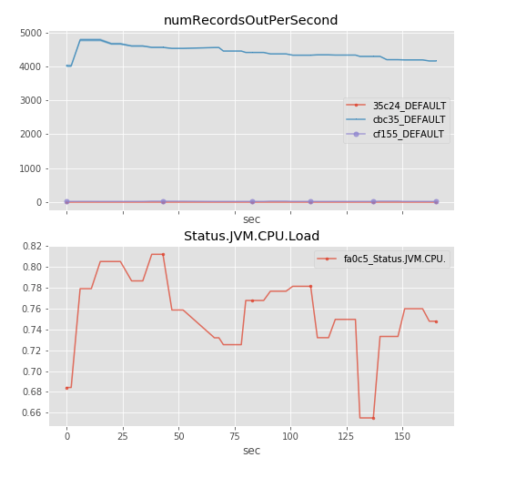

# flink-metrics

Python utilities for analysis and visualization of flink metrics. This is a WIP so expect broken, undocumented and somewhat dirty-code!

Currently, the project includes the Jupyter Notebook `AnalyzeMetrics` that allows the user to **interactively select some task, operator and task managers metrics** from a list of available metrics and then **plots them in real time**. It also records them in a pandas DataFrame for later analysis.

